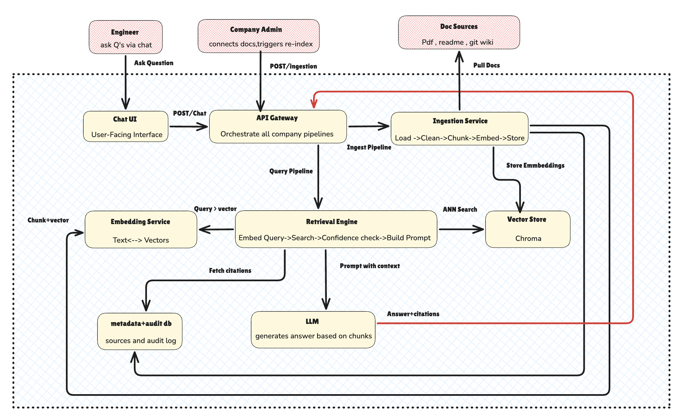

# RAG Documentation Assistant — Architecture

## System Overview

Two pipelines:
- **Ingestion** (offline): reads docs → chunks → embeds → stores in Chroma
- **Query** (online): embeds question → retrieves top-K → LLM generates answer + citations

## Architecture Diagram



## Components

| Component | Tech | Responsibility |
|---|---|---|
| Chat UI | Next.js | User-facing chat interface |
| API Gateway | FastAPI | Orchestrates all pipelines, CORS, auth |
| Ingestion Service | Python | Load → Clean → Chunk → Embed → Store |
| Retrieval Engine | Python | Embed query → ANN search → confidence check → build prompt |
| Embedding Service | BAAI/bge-base-en-v1.5 | Text ↔ dense vectors (shared by ingest + retrieval) |
| Vector Store | Chroma | Per-company isolated namespaces, ANN search |
| LLM | Ollama + Llama 3.1 8B | Generates grounded answers from retrieved context |
| Metadata + Audit DB | SQLite | Doc index, query audit log, citations |

## Offline (Indexing) Pipeline

```
Doc Sources (MD, HTML, PDF, Git)
  → Document Loader     (backend/ingestion/loaders.py)
  → Text Cleaner        (backend/ingestion/loaders.py)
  → Chunker             (backend/ingestion/chunker.py)  ~512 tokens, 10-20% overlap
  → Embedder            (backend/ingestion/embedder.py) BAAI/bge-base-en-v1.5
  → Chroma Vector Store (backend/ingestion/indexer.py)  + SQLite metadata
```

## Online (Query) Pipeline

```
User Question
  → Embed query         (same BAAI/bge-base-en-v1.5)
  → ANN Search Chroma   top-K chunks
  → Confidence Guard    >0.80 pass | 0.60-0.80 warn | <0.60 refuse
  → Prompt Builder      context chunks + system instruction
  → Ollama LLM          generates grounded answer
  → Citation Formatter  chunk metadata → structured citations
  → Response            answer + citations + confidence score
```

## Tech Stack Decisions

| Decision | Choice | Reason |
|---|---|---|
| Backend | Python + FastAPI | Async, fast, great DX |
| LLM | Ollama + Llama 3.1 8B | Free, local, private |
| Embeddings | BAAI/bge-base-en-v1.5 | Best free local model (MTEB) |
| Vector DB | Chroma (embedded) | No infra, persistent, metadata filtering |
| Frontend | Next.js | Production-ready, session management |
| Orchestration | Makefile + cron | Simple, no extra infra |

## Directory Structure

```
/backend
  /api          → chat.py, search.py, admin.py
  /ingestion    → loaders.py, chunker.py, embedder.py, indexer.py, ingest.py
  /retrieval    → retriever.py, context_builder.py
  /generation   → llm_client.py, prompt_templates.py, citation_formatter.py
  /models       → document.py, chunk.py, api_models.py
  /db           → database.py
  main.py

/frontend       → Next.js chat UI
/infra          → docker-compose.yml
/config         → sources.yaml
/docs           → architecture.md
/eval           → golden_set.json, run_eval.py
/data           → raw/, pdfs/, html/, vectordb/ (gitignored)
Makefile
```

## API Endpoints

| Method | Path | Description |
|---|---|---|
| POST | `/api/chat` | Full RAG loop — answer + citations |
| GET | `/api/search` | Semantic search — top-K chunks |
| GET | `/admin/stats` | Doc/chunk count, last indexed |
| GET | `/admin/queries` | Recent query audit log |
| GET | `/health` | Health check |
